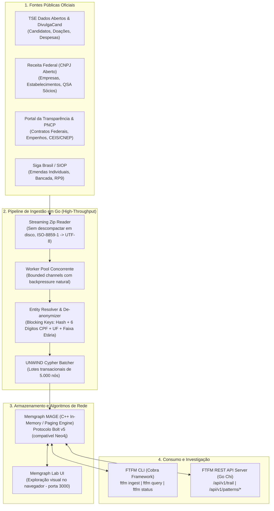
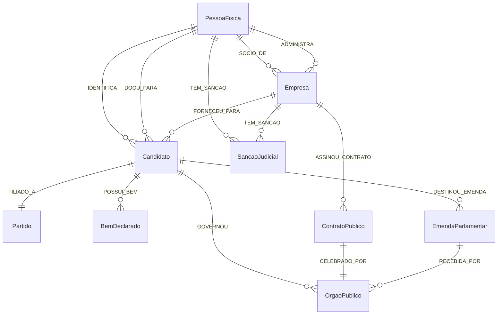

# Follow-The-Fucking-Money (FTFM) 💸🇧🇷

> **Plataforma investigativa de código aberto em Go e Grafos para rastrear o fluxo de capitais entre eleições, quadros societários e contratações do poder público no Brasil.**

---

## 🏛️ Sobre o Projeto

O **Follow-The-Fucking-Money (FTFM)** é um sistema analítico de dados públicos governamentais desenvolvido para responder a perguntas fundamentais da cidadania e do jornalismo investigativo:
* *Quem financiou a campanha do candidato eleito?*
* *Os doadores de campanha (ou suas empresas) foram contemplados com contratos públicos ou emendas após a eleição?*
* *Empresas recém-criadas com capital social irrisório receberam repasses milionários de fundos partidários ou eleitorais?*
* *Existe triangulação entre emendas parlamentares, prefeituras conveniadas e empreiteiras de aliados políticos?*

Para viabilizar essas respostas em larga escala sem estourar os recursos de um ambiente local (*homelab*), o FTFM combina **Engenharia de Concorrência em Go** (com streaming e worker pools) e uma **Ontologia em Grafos de Conhecimento** (Memgraph / Neo4j) com algoritmos de resolução de entidades para contornar as limitações do CPF mascarado da LGPD.

---

## 🏗️ Arquitetura do Sistema



---

## 🗂️ Ontologia do Grafo (Data Model)



### Principais Nós (Labels)
- `:Candidato`: Identificador eleitoral único (`sq_candidate`), nome de urna, cargo, partido, total de bens.
- `:PessoaFisica`: Identidade desambiguada (`id` canônico gerado por hash), nome normalizado, CPF mascarado (`***.123.456-**`).
- `:Empresa`: CNPJ completo (14 dígitos), CNPJ Raiz (8 dígitos), Razão Social, Capital Social, CNAE, UF.
- `:ContratoPublico`: Número do contrato, órgão comprador, valor inicial e final, objeto.
- `:OrgaoPublico`: Unidade Gestora (UG), esfera (Federal, Estadual, Municipal).
- `:EmendaParlamentar`: Código da emenda, autor, tipo (Individual, Bancada, RP9/Relator), valor pago.

### Principais Arestas (Relationships)
- `(:PessoaFisica)-[:DOOU_PARA {valor, data, recibo}]->(:Candidato)`
- `(:PessoaFisica)-[:SOCIO_DE {qualificacao, data_entrada}]->(:Empresa)`
- `(:Empresa)-[:FORNECEU_PARA {valor, data, descricao}]->(:Candidato)`
- `(:Empresa)-[:ASSINOU_CONTRATO {valor, data}]->(:ContratoPublico)`
- `(:ContratoPublico)-[:CELEBRADO_POR]->(:OrgaoPublico)`
- `(:Candidato)-[:DESTINOU_EMENDA]->(:EmendaParlamentar)-[:RECEBIDA_POR]->(:OrgaoPublico)`

---

## 🔍 Padrões Investigativos Pré-Construídos (Cypher)

O FTFM já vem equipado com queries parametrizadas prontas para detecção de anomalias:

1. **Retorno de Investimento de Campanha (*Quid Pro Quo / Pay-to-Play*):**
   - Identifica doadores pessoas físicas cuja empresa ganhou contratos públicos no órgão governado pelo candidato eleito.
   - Execução via CLI: `ftfm query quid-pro-quo --year 2022 --min-amount 50000`
2. **Empresas de Fachada de Campanha (*Ghost Suppliers*):**
   - Detecta fornecedores com capital social irrisório (<= R$ 10.000) que receberam milhões em despesas de campanha.
   - Execução via CLI: `ftfm query ghost-suppliers --year 2022 --min-expense 100000`
3. **Rastreamento de Trilha (*Shortest Path / Follow The Money*):**
   - Descobre o caminho mais curto entre quaisquer duas pessoas, empresas ou políticos.
   - Execução via CLI: `ftfm query trail --from "00000000000191" --to "LULA" --max-depth 4`
4. **Triangulação de Emendas Parlamentares:**
   - Detecta parlamentar destinando emenda a município que contrata empresa de doador da campanha do parlamentar.

---

## 🚀 Como Executar

### 1. Pré-Requisitos
* Go 1.24+ instalado
* Docker e Docker Compose

### 2. Iniciar a Infraestrutura (Graph DB + Visualizador Web)
```bash
make docker-up
```
Isso iniciará:
* **Memgraph MAGE** na porta Bolt `7687`
* **Memgraph Lab UI** no navegador em `http://localhost:3000`

### 3. Compilar e Inicializar os Índices
```bash
make build
./bin/ftfm status --create-indexes
```

### 4. Baixar Dados Públicos e Executar Ingestão
```bash
# Baixar dados eleitorais de 2022 do TSE
./scripts/download_tse.sh 2022

# Ingerir candidaturas, receitas e despesas no grafo
./bin/ftfm ingest tse --year 2022 --source ./downloads/tse/2022/
```

### 5. Iniciar Tudo com Comando Único (All-in-One)
```bash
./setup_and_run.sh
# ou via make: make start-all
```
Isso sobe os containers, aplica as constraints/índices, faz o download do TSE 2022, ingere os dados e expõe a API REST na porta **8075**!

Endpoints disponíveis:
* `GET http://localhost:8075/health`
* `GET http://localhost:8075/api/v1/stats`
* `GET http://localhost:8075/api/v1/trail?from=...&to=...`
* `GET http://localhost:8075/api/v1/patterns/quid-pro-quo?year=2022`
* `GET http://localhost:8075/api/v1/patterns/ghost-suppliers?year=2022`

### 6. Limpeza Completa (Purge Total)
Para parar e remover **tudo** (containers, volumes, imagens Docker, binários e arquivos baixados), mantendo a pasta `downloads/` rastreada no git:
```bash
./scripts/clean_all.sh
# ou via make: make clean-all (ou make purge)
# ou via runner: ./run.sh purge
```

---

## ⚖️ Aviso Legal e Isenção de Responsabilidade (Legal Disclaimer)

> O **Follow-The-Fucking-Money (FTFM)** é uma ferramenta investigativa de código aberto baseada estritamente em dados públicos governamentais oficiais disponibilizados pelo Tribunal Superior Eleitoral (TSE), pela Secretaria da Receita Federal do Brasil (RFB) e pelo Portal da Transparência da CGU, sob a égide da **Lei de Acesso à Informação (Lei nº 12.527/2011)** e da salvaguarda de atividade de interesse público, jornalístico e acadêmico da **LGPD (Lei nº 13.709/2018, Art. 4º, II, 'a')**.
>
> 1. **Natureza Documental:** Todos os nós, conexões e valores apresentados refletem unicamente registros declarados e arquivados nos órgãos emissores na data de sua extração. Esta plataforma **NÃO imputa, deduz ou insinua a prática de quaisquer crimes**, ilícitos administrativos, fiscais ou eleitorais a qualquer pessoa física ou jurídica citada.
> 2. **Liceidade das Atividades:** Doações eleitorais declaradas são instrumentos democráticos regulamentados pela Lei nº 9.504/1997. Da mesma forma, contratos públicos são regidos pela Lei nº 14.133/2021. Conexões documentadas entre pessoas, empresas e campanhas **não configuram, por si sós, irregularidade**.
> 3. **Homônimos e Limitações do CPF Mascarado:** Em conformidade com a legislação fiscal, os órgãos federais divulgam apenas seis dígitos centrais de CPFs (`***.123.456-**`). Embora o FTFM utilize algoritmos de resolução de entidades e *blocking keys*, **existe risco intrínseco de homônimos em nomes comuns**. Usuários e jornalistas são **obrigados a realizar checagem documental e fática independente** antes de qualquer publicação ou acusação pública.

---

## 📄 Licença

Distribuído sob a licença **GNU Affero General Public License v3 (AGPL-3.0)**. Consulte [LICENSE](file:///home/eduardo-homelab/follow-the-fucking-money/LICENSE) para mais detalhes.
